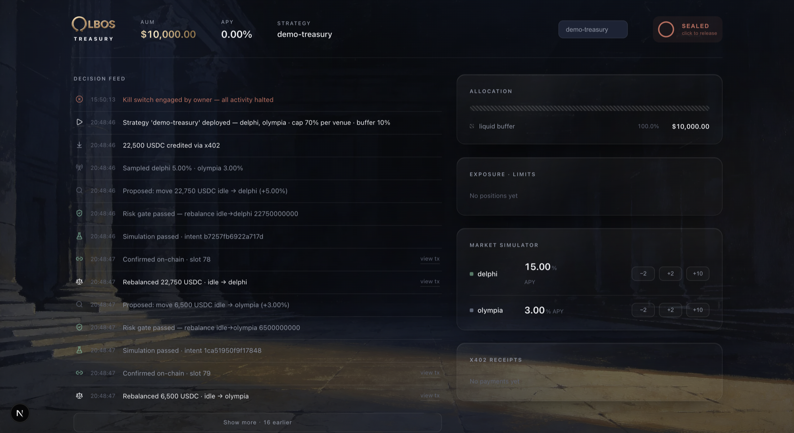

<div align="center">

# Olbos

**The treasury layer of the x402 economy.**

AI agents pay over HTTP; Olbos puts their idle USDC to work on Solana —
autonomously, inside hard owner-set risk bounds, under custody the owner controls.

*Agents pay. Owners sign. Owners can always walk away with their keys.*

[](https://www.npmjs.com/package/@olbos/sdk)
[](https://www.npmjs.com/package/@olbos/mcp)
[](https://www.npmjs.com/package/@olbos/cli)
[](LICENSE)

[Website](https://olbos.tech) · [Documentation](https://docs.olbos.tech) · [Dashboard](https://app.olbos.tech)



</div>

---

## What is Olbos?

Agents in the [x402](https://x402.org) economy accumulate USDC and let it sit
idle. Olbos is an autonomous treasury engine that fixes that: an agent deploys
a strategy, funds it (the x402 payment **is** the deposit), and the engine
allocates capital across vetted Solana lending venues — Kamino Lend, Marginfi —
scored by net risk-adjusted APY and bounded by owner-set policy.

Custody never leaves the owner. Each strategy gets its own
[Swig](https://onswig.com) smart account where the owner's wallet holds root
authority from birth; the engine holds a single revocable, **transfer-less**
role scoped to approved venues and a daily cap. The engine cannot move funds to
anyone — including the owner. Withdrawals are owner-signed; revoking the
engine's access works on-chain even if the Olbos API is down.

This repository contains the open-source client packages. The hosted engine
runs at `api.olbos.tech` — see the [documentation](https://docs.olbos.tech) for
the full architecture.

## Packages

| package | npm | what it's for |
|---|---|---|
| [`@olbos/sdk`](packages/sdk) | [npm](https://www.npmjs.com/package/@olbos/sdk) | TypeScript SDK — give your Solana agent a treasury in five lines |
| [`@olbos/mcp`](packages/mcp) | [npm](https://www.npmjs.com/package/@olbos/mcp) | MCP server — any LLM agent gets treasury tools over the Model Context Protocol |
| [`@olbos/cli`](packages/cli) | [npm](https://www.npmjs.com/package/@olbos/cli) | `olbos init` — interactive onboarding wizard for humans |

## Quickstart

### Agents (MCP)

Works with any MCP host — Claude Code shown:

```bash
claude mcp add olbos \
  --env OLBOS_API=https://api.olbos.tech \
  --env OLBOS_PAYMENT=x402 \
  --env OLBOS_AGENT_KEYPAIR=/path/to/agent-keypair.json \
  --env OLBOS_RPC=https://api.mainnet-beta.solana.com \
  -- npx @olbos/mcp
```

Then just talk: *"you've got idle USDC — park it somewhere safe"* becomes
`deploy_strategy` → `fund_strategy` → capital working within policy, fully audited.

### Programmatic (SDK)

```bash
npm install @olbos/sdk
```

```ts
import { createOlbos, usdc } from "@olbos/sdk";

const olbos = createOlbos({
  baseUrl: "https://api.olbos.tech",
  payment: { mode: "x402", keypair: agentKeypair, network: "solana" },
});

const { strategyId } = await olbos.deployStrategy({ template: "balanced" });
await olbos.fund(strategyId, usdc(5000)); // the x402 payment IS the deposit
```

Every metered call is auto-paid over x402 (gasless — the facilitator sponsors
fees). The SDK hides the whole 402 dance.

### Humans (CLI)

```bash
npx @olbos/cli init
```

An interactive wizard: pick a risk template, deploy a strategy, fund it, watch
the engine work.

## How it works

1. **Deploy** — a strategy is created with its own Swig smart account. The
   owner's wallet holds root authority on-chain, immutably, from the first
   transaction. The engine receives one scoped role: approved venues only,
   daily cap, no transfer power.
2. **Fund** — the settled x402 transfer is the deposit. No separate funding
   step, no approval dance.
3. **Allocate** — venues are scored by net risk-adjusted APY (utilization
   haircuts, TVL floors). Every move passes a pure risk gate and a break-even
   gate (moves that can't beat their own gas don't happen), and is simulated
   before broadcast.
4. **Audit** — every decision, payment, simulation, and on-chain action lands
   in an append-only event log, readable via `get_audit_log` / `olbos.auditLog()`.
5. **Exit** — withdrawals unwind positions and pay out via an owner-signed
   transfer. Break-glass: the owner can kill a strategy or revoke the engine's
   custody role entirely, on-chain, without the Olbos API.

Full details: [How it works](https://docs.olbos.tech/docs/how-it-works) ·
[Custody](https://docs.olbos.tech/docs/custody) ·
[Strategies](https://docs.olbos.tech/docs/strategies) ·
[Payments](https://docs.olbos.tech/docs/payments)

## Security model

- **Agents pay, owners sign.** Metered operations settle over x402; custody
  scope and break-glass require the owner's wallet signature — never purchasable.
- **The engine is transfer-less.** Its on-chain role cannot move funds to any
  address. Verified by an on-chain rug test on every deploy.
- **Simulate before you act.** Nothing failing `simulateTransaction` is broadcast.
- **Compliance trumps yield.** Positions exceeding policy caps unwind even at
  negative improvement.

Read the full model: [Security](https://docs.olbos.tech/docs/security)

## Development

```bash
pnpm install
pnpm -r build
pnpm -r test
```

Requires Node ≥ 22 and pnpm 9.

## License

[MIT](LICENSE) © Olbos Labs
